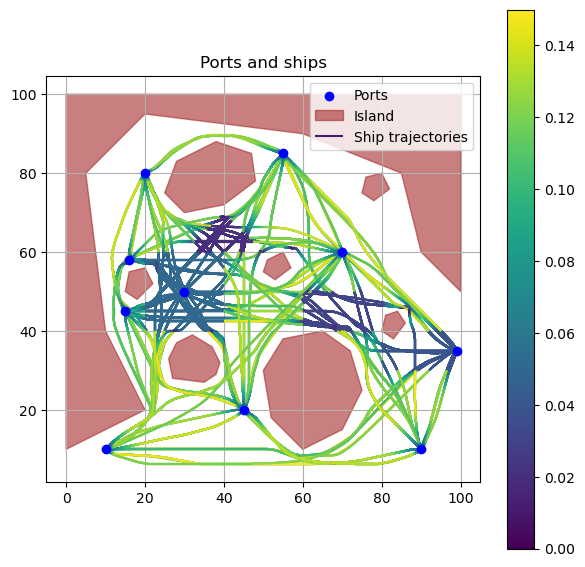

# Ship simulation

Agent based simulation of ship movements between ports, using dynamic window routing path finding, with support for speed restrictions.



## Installation


``` bash
pip install mesa==2.4.0 shapely movingpandas
```

## Components

### Agents

* Ports (`agents/port.py`) ... Fixed locations in the simulation space that serve as start and end points for ship trips
* Ships (`agents/ship.py`) ... Ships travel from an origin port to a destination port using their desired speed. They use path finding based on dynamic window routing(`dynamic_window_approach.py`) and A* routing (`a_star.py`).
* Obstacle (`agents/obstacle.py`) ... Areas that ships avoid. 

### Model

* The ShipModel (`model.py`) initializes the simulation based on the configuration (`config/config.json`) and runs it.

## Documentation

Usage examples are provided in the `ships.ipynb` notebook, including simulation of vessel movements and generation of synthetic movement anomalies. 

## Acknowledgements

This work was supported in part by the Horizon Framework Programme of the European Union under grant agreement No. 101070279 ([MobiSpaces](https://mobispaces.eu)). 